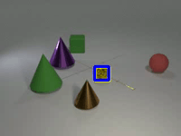

# Learning Object Permanence from Video
Code for our paper: *Shamsian, *Kleinfeld, Globerson & Chechik, "Learning Object Permanence from Video" <br>

<a href="https://arxiv.org/abs/2003.10469" target="_blank">paper</a> <br>
<!-- <a href="https://chechiklab.biu.ac.il/~yuvval/COSMO/" target="_blank">project page</a> <br> -->



## Installation
### Code and Data

 1. Download or clone the code in this repository
 2. cd to the project directory
 3. Our dataset and trained models will be available for download in the upcoming days

### Anaconda Environment

Quick installation using Anaconda:
  
`conda env create -f environment.yml`
    

## Directory Structure
directory | file | description
---|---|---
`./` | `main.py` | Main entry point for running experiments and analyzing their results
`baselines/` | * | Contains the implementation of OPNet and other baseline variants
`baselines/DaSiamRPN/` | * | Contains code cloned from the [DaSiamRPN](https://github.com/foolwood/DaSiamRPN) model repository
`baselines/` | `learned_models.py` | Contains the implementation of OPNet and 4 learned baselines
`baselines/` | `programmed_models.py` | Contains the implementation of the programmed baselines
`generate/` | * | Contains code used to generate new dataset samples and annotations. Built on top of the [CATER](https://github.com/rohitgirdhar/CATER) code base.
`object_detection/` | * | Contains code used for fine tunning an object detection model. Base on the following [Pytorch tutorial](https://pytorch.org/tutorials/intermediate/torchvision_tutorial.html)
`configs/` | * | Contains model, training and inference configuration files


## Execute OP Experiments
The `main.py` file supports 4 operation modes - training, inference, results analysis and data preprocessing.
You can run `python main.py --help` to view the available operation modes.
Also, executing `python main.py <operation_mode> --help` will provide details about the required arguments for executing the chosen operation mode.

### Training
For training one of the available models,
run the command `python main.py training` with the following arguments:
```
--model_type <name of the model to use>
--model_config <path to a json file containing model configuration>
--training_config <path to a json file containing training configuration>
```

The currently supported model types are: 
1. opent 
2. opnet_lstm_mlp
3. baseline_lstm
4. non_linear_lstm
5. transformer_lstm

Model configuration files and an example training configuration file are provided in the `configs` directory.
For running experiment on the "learning from only visible frames" setup (Section 7.2 in the paper) just use the prefix "no_labels" after the model name. for example ```opnet_no_labels```.
 
### Inference
For using a trained model to perform inference on an unlabeld data, 
run the command `python main.py inference` with the following arguments:
```
--model_type <name of the model to use>
--results_dir <path to a directory to save result predictions>
--model_config <path to a json file containing model configuration>
--inference_config <path to a json file containing inference configuration>
```
An example inference config file is provided in the `configs` directory

### Results Analysis
For analyzing results received after invoking the `inference` command, run `python main.py analysis` with the following *required* arguments:
```
--predictions_dir <path to a directory containing inference results>
--labels_dir <path to a directory containing label annotations>
--output_file <csv file name for the analyzed results output>
```
Various frame level annotation files can also be supplied as arguments when running `python main.py analysis`.
Following is an example of a bash command to analyze results using detailed frame level annotations
```sh
$ python main.py analysis 
--predictions_dir test_results/opnet/ 
--labels_dir test_data/labels 
--containment_annotations test_data/containment_and_occlusions/containment_annotations.txt
--containment_only_static_annotations test/data/containment_and_occlusions/containment_only_static_annotations.txt 
--containment_with_movements_annotations test/data/containment_and_occlusions/containment_with_move_annotations.txt 
--visibility_ratio_gt_0 test_data/containment_and_occlusions/visibility_rate_gt_0.txt
--output_file results.csv
```

### Data Preprocessing
OPNet and the other baseline models receive as input the localization annotations (bounding boxes) of all the visible objects in each video frame.
This input is the results of running an object detection model on raw video frames.
For running an object detection and generating visible object annotations run `python main.py preprocess` with the following arguments:
```
--results_dir <path to a directory to save result annotations>
--config <path to a json configuration file>
```
An example preprocess config file is provided in the `configs` directory

## Cite our paper
If you use this code, please cite our paper.

    @inproceedings{shakleglobchec2020OP,
    title={Learning Object Permanence from Video},
    author={Shamsian, Kleinfeld, Globerson and Chechik},
    booktitle = {arXiv preprint arXiv:2003.10469}
    year={2020},
    } 


